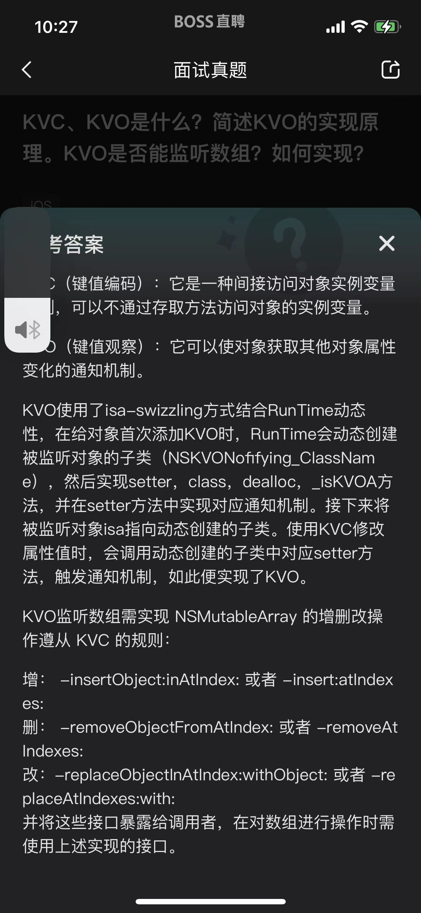

# Objective-C

## 1. 简述KVO的实现原理。KVO是否能监听数组？如何实现？

> 扩展: 
> observer添加后，runtime交换 set方法，监听会失效吗？

## 2. Crash的场景
1. 指针问题: 野/空指针, 方法指针
2. 内存问题: 循环引用, 数组越界, 大量对象爆内存 
3. 编译问题:  编译项设置错误
4. 线程安全问题: 死锁, 多线程访问资源
5. 未处理"受检异常"

> iOS中具体的场景:
> 1. unrecognized selector sent to instance 
> 2. 数组越界，插入空值
> 3. `[NSDictionary initWithObjects:forKeys:]`使用此方法初始化字典时，objects和keys的数量不一致时
> 4. `NSMutableDictionary，setObject:forKey:`或者`removeObjectForKey:`时，key为nil
> 5. `setValue:forUndefinedKey:`，使用KVC对对象进行存取值时传入错误的key或者对不可变字典进行赋值
> 6. `NSUserDefaults 存储时key为nil`
> 7. 对可变集合或字符串使用copy修饰并进行修改操作
> 8. 在空间未添加到父元素上之前，就使用autoLayout进行布局
> 9. KVO在对象销毁时，没有移除KVO或者多次移除KVO
> 10. IBOutlet

